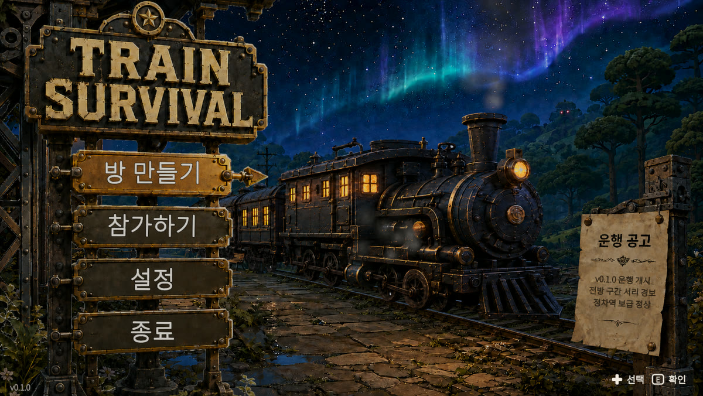
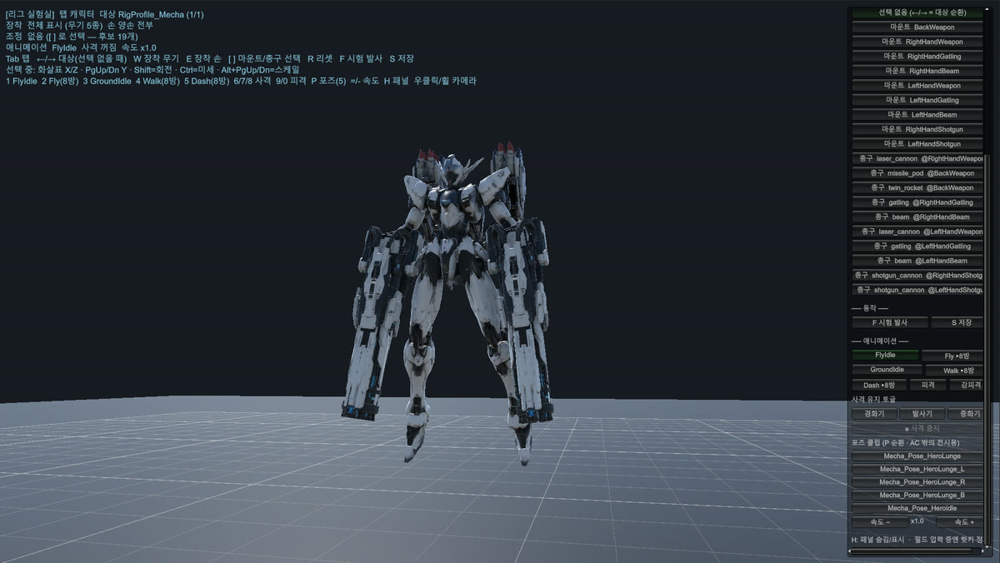
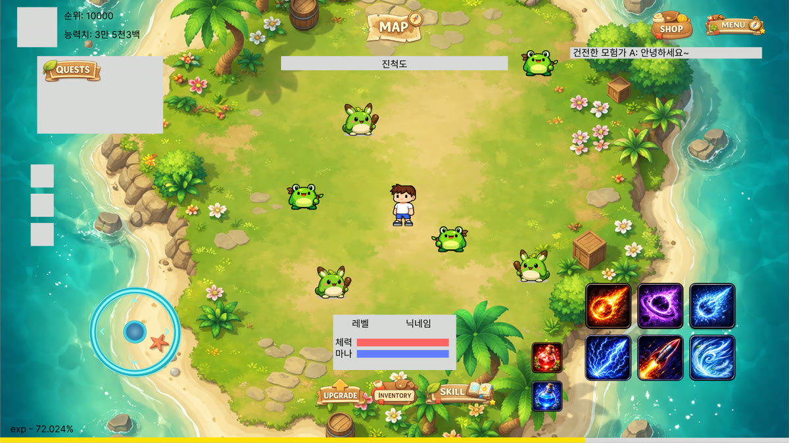
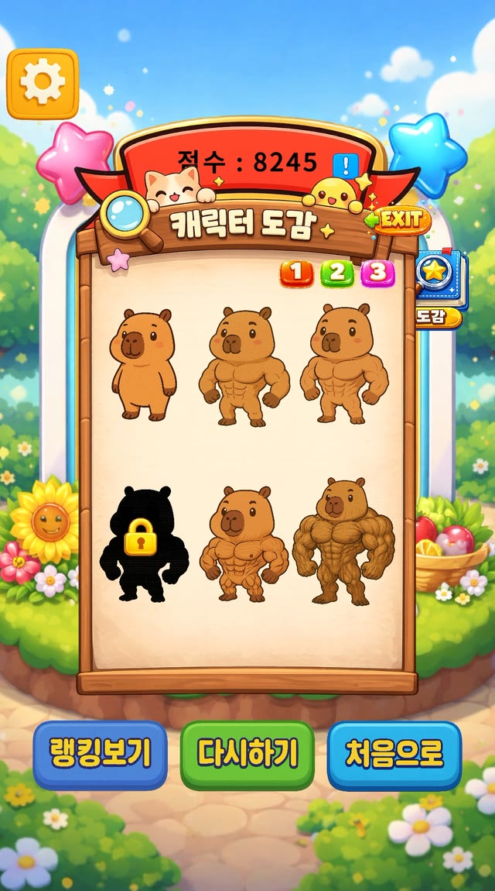
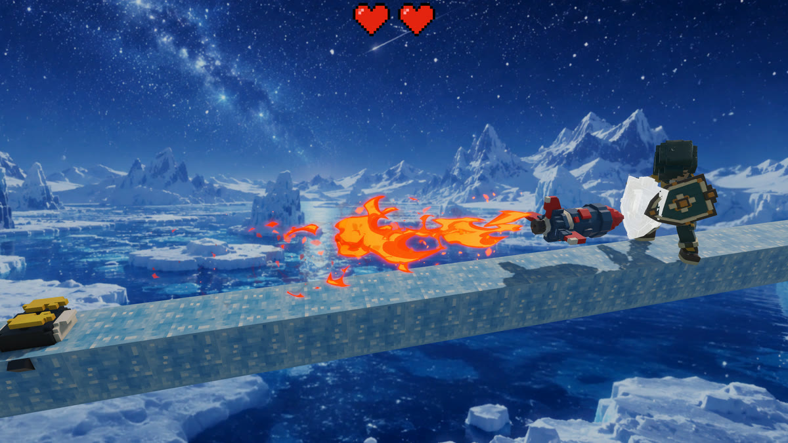
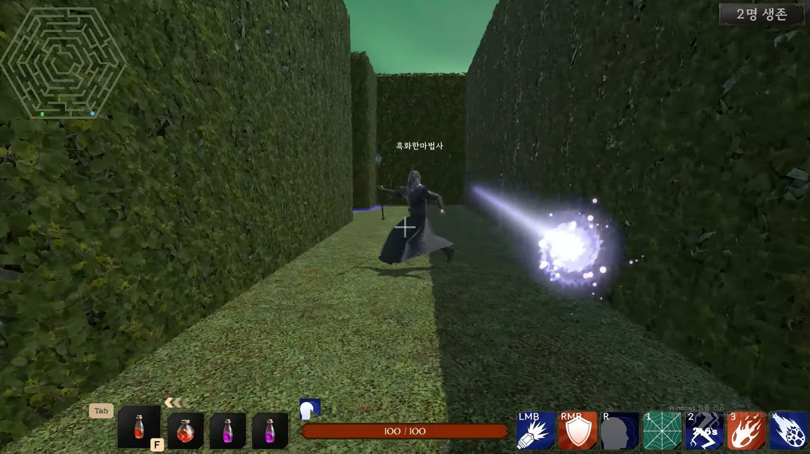

<!--
═══════════════════════════════════════════════════════════════════════════
  📷 프로젝트 여섯 곳의 이미지가 모두 채워져 있습니다.
  train.jpg · mecha.jpg · idle.jpg · capybara.jpg · gesture.jpg · wizard.jpg

  교체하려면 assets/ 의 파일을 같은 이름으로 덮어쓰면 됩니다.

  권장 1000 × 560 (화면에는 500px 폭으로 보입니다). 세로로 하나씩 놓이므로
  비율이 조금 달라도 줄이 어긋나지 않고, 한 장씩 따로 채워도 됩니다.
  움직이는 게 필요하면 .gif 도 그대로 됩니다 (5MB 이하 권장).
═══════════════════════════════════════════════════════════════════════════
-->

### 핵심 재미를 빠르게 구현하고 검증하며, 유저가 다시 플레이할 이유를 만드는

**게임 클라이언트 개발자 이한울**입니다.

 

- 직관적이고 **단순한 규칙에서 참신한 재미**가 만들어지는 게임을 설계합니다.
- **기획부터 개발, 아트까지 직접** 수행하며 아이디어를 플레이 가능한 게임으로 구현합니다.
- **협동 멀티플레이**, **생존·전투 루프 설계**, **안정적인 입력 시스템** 구현에 강점이 있습니다.
- 프로젝트 초기 설계부터 개발 계획, 구현, QA, 문서화, 출시까지 **전 과정을 체계적으로** 운영합니다.
- **SOLID 원칙과 객체지향 설계**를 일관되게 적용해 **확장성과 유지보수성**이 뛰어난 게임을 개발합니다.

 

# 💪 강점

## 기획 · 아트 · 개발을 혼자 완주합니다

게임 하나가 굴러가려면 필요한 세 축을 **전부 직접** 만듭니다. 외주나 팀원을 기다려서 막히는 구간이 없습니다.

| | 직접 하는 일 | 확인할 수 있는 곳 |
|---|---|---|
| **기획** | 코어 루프 · 세계관 · 밸런스를 **기획서로 확정하고** 구현을 시작한다 | Train Survival 기획서 · 세계관 · 비주얼/UIUX · 오디오 · 아트 예산 [문서 6종](https://github.com/hanwoolhanwool/Train-Survival/tree/main/docs/design) |
| **아트** | Blender 와 생성형 3D 도구로 에셋을 직접 만들고 다듬어 **URP 에 얹는다** | [Mecha Survivor 리그 · 히어로 포즈 문서](https://github.com/hanwoolhanwool/Mecha-Survivor/tree/main/Docs) · Train Survival 열차 · 지형 아트 패스 |
| **개발** | 클라이언트 · 네트워크 · UI · 에디터 툴까지 **전부 직접 쓴다** | Train Survival 스크립트 308개 · Netcode 1~4인 멀티플레이 |

**Train Survival** 은 이 셋을 혼자 돌려 만들고 있는 프로젝트이고,
**카피바라 몸짱 만들기** 는 2인 팀에서 기획 · 개발 총괄과 아트를 맡아 **출시까지** 끌고 간 결과물입니다.

 

## 혼자여도 팀처럼 굴립니다

1인 개발이라고 절차를 건너뛰지 않습니다. 기능 하나가 **초기 세팅 → 구현 계획 → 구현 · QA → 문서화** 를 순서대로 통과하고,
그 흔적이 전부 저장소에 남아 **결과물뿐 아니라 과정도 열어 볼 수 있습니다.**

| 단계 | 하는 일 | 남는 것 |
|---|---|---|
| **1 · 초기 세팅** | 어셈블리 계층 · 폴더 배치 · 코드 컨벤션 · 테스트 러너 · 커밋 규약을 **코드 한 줄 쓰기 전에** 고정한다 | [`docs/conventions`](https://github.com/hanwoolhanwool/Train-Survival/tree/main/docs/conventions) |
| **2 · 구현 계획** | 마일스톤을 기능 단위로 쪼개 **구현 계획서**를 먼저 쓴다 — 범위 · 순서 · 완료 조건을 문서에서 확정하고 시작한다 | [`docs/plans`](https://github.com/hanwoolhanwool/Train-Survival/tree/main/docs/plans) |
| **3 · 구현 · QA** | 구현과 함께 **플레이 검증 항목**을 만들어 직접 돌리고, 나온 문제는 후속 수정으로 계획서에 다시 적는다. 회귀는 **EditMode 테스트**가 막는다 | [플레이 검증 항목](https://github.com/hanwoolhanwool/Train-Survival/tree/main/docs/plans/M8) · [EditMode 753개](https://github.com/hanwoolhanwool/Train-Survival/tree/main/Assets/_Project/Tests) |
| **4 · 문서화** | 완성된 기능은 **as-built 명세**로 남겨, 다음 기능이 추측이 아니라 그 문서 위에서 시작하게 한다 | [`docs/specs`](https://github.com/hanwoolhanwool/Train-Survival/tree/main/docs/specs) |

같은 방식을 Idle Game 에도 적용해, Player 도메인 하나에 <a href="https://github.com/hanwoolhanwool/Idle-Game/tree/main/docs/specs/player">기술 명세 10편</a>이 남아 있습니다.

 

# 🛠 Tech Stack

&nbsp;

&nbsp;

설계 · 최적화 &nbsp;—&nbsp; `FSM` `ScriptableObject` `Event Bus` `Service Locator` `Object Pooling` `Addressables` `async/await`

 

# 🚀 Projects

## 진행 중 · 1인 개발

### 🚂 Train Survival

 &nbsp; [🔗 저장소](https://github.com/hanwoolhanwool/Train-Survival)

 

**Overview** : 1~4인 협동 생존 크래프팅  
2026.07 – 진행중

 

**역할**
- 기획 · 클라이언트 · 네트워크 · 아트 파이프라인 **전 구간 1인 담당**
- Netcode for GameObjects 기반 **1~4인 세션 · 소유권 · 상태 동기화** 설계
- 낮/밤 사이클과 지역 전환에 맞춘 **몬스터 웨이브 · 생존 자원 루프** 구현
- 스폰 · 이벤트 · 전역 접근을 **인프라 계층으로 분리** (PoolManager · EventBus · ServiceLocator)

**성과**
- 커밋 531 · 스크립트 308개 · **EditMode 테스트 753개 통과**
- 어셈블리 단방향 의존 규칙을 컨벤션 문서로 고정 → 기능 추가 시 회귀 차단
- 기획서 · 네트워크 아키텍처 · 아트 예산까지 **설계 문서 6종** 유지

 

### 🤖 Mecha Survivor

 &nbsp; [🔗 저장소](https://github.com/hanwoolhanwool/Mecha-Survivor)

 

**Overview** : 3D 공중전 메카 뱀서라이크  
2026.07 – 진행중

 

**역할**
- 뱀서라이크에서 **성장 구조만** 빌려오고 전투를 액션 슈터로 재설계
- **쿨다운 로테이션 무기 시스템** — A가 쿨다운에 들어가면 B·C로 압박을 잇는다
- Y축을 쓰는 **3D 공중 이동 · 수동 조준** 컨트롤
- Core · Systems · Gameplay · UI · Utilities **단방향 어셈블리** 구성

**성과**
- 커밋 72 · 스크립트 192개
- "손이 놀지 않게 한다"는 설계 목표를 쿨다운 로테이션이라는 장치로 구체화
- 무기 · 난이도 · 업그레이드를 문서로 분리 → 밸런스 수정 비용 절감

 

### 💤 Idle Game

 &nbsp; [🔗 저장소](https://github.com/hanwoolhanwool/Idle-Game)

 

**Overview** : 방치형 어드벤처  
2026.03 – 진행중

 

**역할**
- Player 도메인을 **상태 머신 · 스탯 · 스킬 · 전투 · 입력 등 10개 시스템으로 분리**
- 기능마다 **설계 근거와 다이어그램을 기술 명세로 고정**
- 문서 폴더를 코드의 `Features/<도메인>` 구조와 그대로 미러링

**성과**
- 스크립트 145개 · **기술 명세 11편** (Player 10 · Enemy 1)
- 읽는 순서를 명세 README에 정리 → 인수인계 가능한 문서 세트 완성

 

## 출시 · 팀 프로젝트

### 🦫 카피바라 몸짱 만들기

[🔗 케이스 문서](https://hanwoolhanwool.github.io/portfolio/capybara-portfolio.html)

 

**Overview** : 토스 앱인에 출시한 WebGL 리듬 게임 — **인기 순위 87위**  
2인 팀 · 2025.10 – 12 · **2026.04.10 출시**

 

**역할**
- **기획 · 개발 총괄**
- 리듬 **판정 로직**과 리더보드 연동
- WebGL 성능 최적화, **WebGL · AAB 빌드와 배포**
- 출시 후 유저 피드백 기반 **버그 · 밸런스 · 편의 기능 라이브 개선**

**성과**
- 토스 앱인 **인기 순위 87위**
- 커밋 68 · 스크립트 44/46 · **자체 코드 90.1%**
- 기획부터 출시, 라이브 개선까지 한 사이클 완주

 

### ✋ 열받는 게임

[🔗 케이스 문서](https://hanwoolhanwool.github.io/portfolio/sam-i-bang-portfolio.html)

 

**Overview** : 키보드 대신 웹캠 앞의 손동작으로 조작하는 3D 액션  
3인 팀 · 2026.05 – 06 · `Unity 6` · `MediaPipe`

 

**역할**
- MediaPipe 추론이 게임 명령이 되기까지 **5레이어 입력 파이프라인 전 구간 설계**
- 워커 스레드 → 메인 스레드 **경계 처리** (ConcurrentQueue · 큐 상한 30 · 객체 풀링)
- **좌표 정제** (OneEuroFilter · 신뢰도 게이트 · handedness 안정화)
- 플레이어 · 몬스터 · 보스와 레벨 디자인

**성과**
- 커밋 197 · 전담 모듈 14,873줄 · **자체 코드 49.1%**
- 인식 계층이 게임을 전혀 모른 채 **단독 테스트 가능한 구조** 확보
- 입력 수단(제스처 · 키보드)을 **갈아 끼울 수 있게** 분리

 

### 🧙 Trophy Hunter : Wizard War

[🔗 케이스 문서](https://hanwoolhanwool.github.io/portfolio/wizard-war-portfolio.html)

 

**Overview** : Photon PUN2 기반 1인칭 4인 마법 배틀  
4인 팀 · 2025.10 – 11 · `Unity` · `Photon PUN2`

 

**역할**
- **매칭 시스템** 설계 · 구현
- **룸 진행 · 방장 교체 · 이탈 복구** 등 세션 흐름 처리
- 기획 + 클라이언트 + QA 겸임

**성과**
- 커밋 153 · **매칭 시스템 81% 소유** · 자체 코드 19.9%
- 중도 이탈이 나와도 게임이 끊기지 않는 룸 흐름 확보

 

팀 프로젝트의 기여 수치는 저장소를 클론해 <code>git log --author</code> 와 <code>git blame --line-porcelain</code> 으로 직접 집계했고, 담당이 아닌 영역도 케이스 문서에 함께 적어 두었습니다.

 

# 🏃 Career

- **[인턴십] 멋쟁이사자처럼 × 검은토끼흰토끼** — 게임 클라이언트 개발 · 2026.04 – 05
- **멋쟁이사자처럼 유니티 게임 개발 5기** · 2025.05 – 12
- **전북 글로벌게임센터 게임 콘텐츠 전문인력 양성과정 (UE5)** · 2024.07 – 08 — 🏆 우수상
- **원광대학교 게임콘텐츠학과** · 2019.03 – 2026.03 — 🏆 성적 우수 표창 (아너스 클럽)
- **유튜브 채널 운영** · 2022 — 기획 · 편집 · 업로드 전 과정, 누적 24만 조회

 

# 📫 Contact

- **Portfolio** : [hanwoolhanwool.github.io/portfolio](https://hanwoolhanwool.github.io/portfolio/)
- **GitHub** : [github.com/hanwoolhanwool](https://github.com/hanwoolhanwool)

더 자세한 기여 수치와 문제 해결 기록은 포트폴리오 각 케이스 문서에 있습니다.
